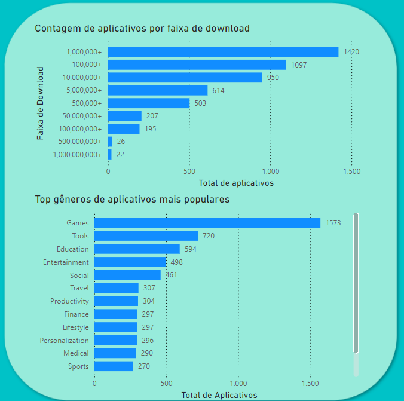
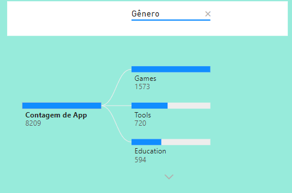

📊 Análise de Dados de Aplicativos da Google Play Store

📑 Visão Geral

Este projeto utiliza Power BI para analisar dados da Google Play Store, com o objetivo de fornecer insights sobre as características dos aplicativos disponíveis na plataforma. A análise aborda aspectos como avaliações, preços, notas, tipos de aplicativos, entre outros, auxiliando desenvolvedores, profissionais de marketing e gestores de produto na tomada de decisões.

📂 Estrutura do Repositório

O repositório está organizado em quatro pastas principais:

* datasets: Contém os arquivos originais dos datasets utilizados para a análise.
* processed data: Armazena os datasets após o tratamento de dados realizado nos notebooks.
* dashboard: Guarda os arquivos de dashboards criados no Power BI.
* notebooks: Inclui os notebooks utilizados para o tratamento e análise exploratória dos dados (EDA).
Notebooks

Na pasta notebooks, você encontrará:

* 01A-limpeza-de-dados.ipynb: Notebook responsável pelo tratamento do primeiro dataset.
* 01B-limpeza-de-dados.ipynb: Notebook responsável pelo tratamento do segundo dataset.
* 02-EDA.ipynb: Contém a análise exploratória de dados (EDA) de um dos datasets tratados.

🚀 Objetivo

O principal objetivo deste projeto é explorar os dados dos aplicativos da Google Play Store, identificando padrões e tendências que possam ser úteis para diferentes stakeholders, como desenvolvedores e profissionais de marketing. Com os dashboards criados, é possível visualizar de forma intuitiva as métricas mais relevantes e obter insights valiosos para a tomada de decisões.

📊 Dashboards Criados
1. Dashboard: Visão Geral dos Aplicativos
Este dashboard apresenta uma visão abrangente dos aplicativos analisados, incluindo:

Gráfico de Barras: Comparações entre a quantidade de downloads e o gênero dos aplicativos

Mapa de Árvore (Tree Map): Distribuição dos aplicativos por gênero principal.

📈 Insights Obtidos
Aplicativos Gratuitos vs Pagos: Uma maioria significativa dos aplicativos na Google Play Store são gratuitos, o que pode influenciar na estratégia de monetização dos desenvolvedores.

Distribuição de Preços: A análise de preços revela que aplicativos pagos variam bastante em preço, com alguns segmentos específicos mostrando um custo médio significativamente maior.

Gêneros Populares: Certos gêneros de aplicativos, como jogos e ferramentas, dominam a loja, mas a diversidade dentro de subgêneros oferece oportunidades para nichos específicos.